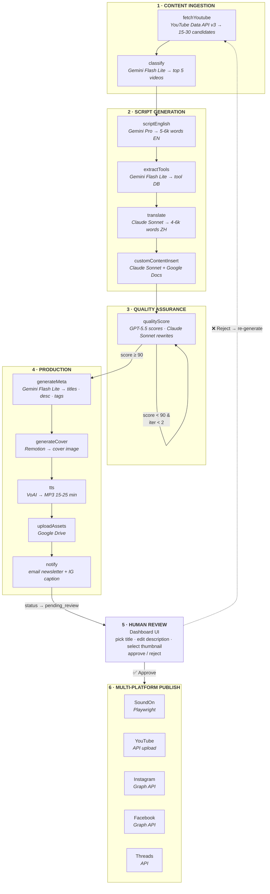
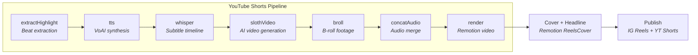
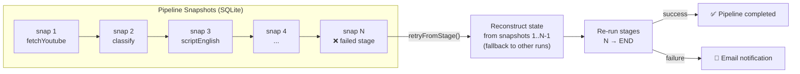
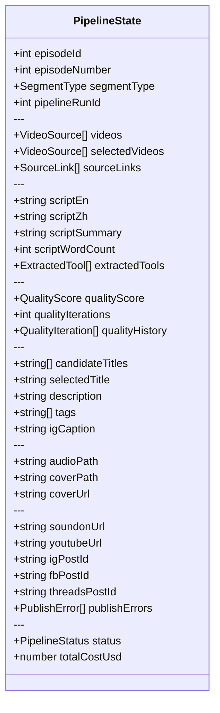

# LangGraph in AI Podcast Automation — Architecture Deep Dive

> **Elevator Pitch**: I built a fully automated podcast production pipeline using LangGraph as the orchestration backbone — it ingests YouTube videos, generates bilingual scripts, runs multi-model quality scoring loops, synthesizes audio via TTS, and publishes to 5 platforms (SoundOn, YouTube, Instagram, Facebook, Threads). The system processes ~6 episodes/week in production with per-call cost tracking, snapshot-based recovery, human-in-the-loop review, and a YouTube Shorts generation sub-pipeline.

---

## System Architecture

### End-to-End Pipeline



### Pipeline at a Glance

```
 ┌─────────────┐    ┌──────────────────┐    ┌────────────┐    ┌───────────────┐    ┌──────────┐    ┌──────────┐
 │  1. Ingest   │───▶│  2. Script Gen    │───▶│  3. QA     │───▶│  4. Production │───▶│ 5. Review│───▶│6. Publish│
 │              │    │                    │    │            │    │               │    │          │    │          │
 │ fetchYoutube │    │ scriptEnglish      │    │ qualityScore│   │ generateMeta  │    │ Dashboard│    │ SoundOn  │
 │ classify     │    │ extractTools       │    │ (GPT ⇄ Clau)│  │ generateCover │    │ approve/ │    │ YouTube  │
 │              │    │ translate          │    │ loop ≤ 2x  │    │ tts           │    │ reject   │    │ Instagram│
 │              │    │ customContentInsert│    │ target: 90 │    │ uploadAssets  │    │ thumbnail│    │ Facebook │
 │              │    │                    │    │            │    │ notify        │    │ select   │    │ Threads  │
 └─────────────┘    └──────────────────┘    └────────────┘    └───────────────┘    └──────────┘    └──────────┘

 YouTube API          Gemini · Claude         GPT-5.5            Gemini · Remotion    Next.js UI     Playwright
                      OpenRouter              Claude Sonnet       VoAI · Drive                        API · Graph API
```

### Shorts Sub-Pipeline



### Snapshot Recovery & Retry



### Data Flow Summary

| Stage | Input | Output | Model | Cost/ep |
|-------|-------|--------|-------|---------|
| fetchYoutube | YouTube Data API v3 | 15-30 video candidates | — | $0 |
| classify | Video metadata + transcripts | Top 5 classified videos | Gemini Flash Lite | ~$0.01 |
| scriptEnglish | 5 transcripts (~50k tokens) | 5000-6000 word EN script | Gemini Pro | ~$0.30 |
| extractTools | EN script | Tool names + categories | Gemini Flash Lite | ~$0.01 |
| translate | EN script + audience memory | 4000-6000 word ZH script | Claude Sonnet | ~$0.15 |
| customContentInsert | ZH script + Google Doc | ZH script w/ sponsor | Claude Sonnet | ~$0.05 |
| qualityScore | ZH script | Score (0-100) + feedback | GPT-5.5 + Claude Sonnet | ~$0.40 |
| generateMeta | Scripts + summary | Titles, description, tags | Gemini Flash Lite | ~$0.05 |
| generateCover | Script summary | Cover image | Remotion | ~$0 |
| tts | ZH script (~5000 chars) | MP3 audio (15-25 min) | VoAI | ~$3.00 |
| uploadAssets | Audio + cover | Google Drive URLs | — | $0 |
| notify | All metadata | Email newsletter + IG caption | Gemini Flash Lite | ~$0.03 |

**Total: ~$4-7/episode** (LLM ~$1 + TTS ~$3-5)

---

## Tech Stack

| Layer | Technology |
|-------|-----------|
| Frontend | Next.js 16 + TypeScript + Tailwind 4 + App Router |
| Pipeline | LangGraph (StateGraph + Annotation API) |
| Database | SQLite (WAL mode, 17 tables) |
| LLM Routing | Custom LLMService → OpenRouter (multi-model) |
| TTS | VoAI API (Taiwan Mandarin) |
| Video | Remotion (covers + shorts rendering) |
| AI Video | Kie.ai (Veo3 + Kling 2.6) |
| Browser Automation | Playwright (SoundOn upload) |
| Scheduling | node-cron |
| API Routes | ~64 endpoints |

---

## Why LangGraph — And Why Not the Full LangChain Stack

### What I use from LangGraph

```typescript
// graph.ts — the ONLY file that imports LangGraph
import { Annotation, StateGraph, START, END } from '@langchain/langgraph';
```

That's it. Four imports. Here's why each matters:

- **`StateGraph`** — Defines the DAG of 12 nodes with typed state transitions
- **`Annotation.Root()`** — Provides "last-writer-wins" state management across nodes
- **`START / END`** — Entry/exit markers for the compiled graph
- **`.compile().invoke()`** — Executes the pipeline as a single async call

### What I deliberately DON'T use

| LangChain Feature | Why I Skipped It |
|---|---|
| `ChatOpenAI` / model wrappers | I need per-call cost logging + multi-model routing. My `LLMService` does `fetch()` → OpenRouter → auto-logs to SQLite. LangChain wrappers would add abstraction without giving me the cost visibility I need. |
| `PromptTemplate` | My prompts are segment-specific (daily/weekly/robot/sysdesign) with complex conditional logic. Template strings are more readable than chaining LangChain prompt objects. |
| `OutputParser` | LLM responses need defensive parsing (try direct JSON → try markdown block → try regex extract). A 10-line function beats importing a parser class. |
| `AgentExecutor` / Tools | This is a deterministic pipeline, not an agentic loop. Every node does exactly one job. |
| Conditional edges | Quality scoring is the only "loop" — I handle it with a `for` loop inside the node, not a graph edge. Simpler to reason about. |

### The Design Principle

> **Use the framework for what it's good at (orchestration), build the rest yourself.**

LangGraph gives me: typed state flow, compiled execution, clear node boundaries.
I build myself: LLM routing, cost tracking, snapshot recovery, retry logic — things that need to be tightly integrated with my database.

---

## State Design



**Key insight**: Each node reads what it needs and writes what it produces. The `Annotation.Root()` ensures "last-writer-wins" — if `qualityScore` rewrites `scriptZh`, downstream nodes automatically get the updated version.

The state is a **flat object by design**. No nested structures, no complex reducers. This makes snapshot serialization trivial (`JSON.stringify(partialOutput)`).

---

## 5 Key Engineering Decisions

### 1. Snapshot-Based Recovery (retryFromStage)

**Problem**: A 20-minute pipeline fails at stage 10. Re-running from scratch wastes $4+ and 20 minutes.

**Solution**: Every node's output is saved as a snapshot in `pipeline_snapshots` table.

```
pipeline_snapshots
├── pipeline_run_id: 42
├── stage: "scriptEnglish"
├── output_data: '{"scriptEn": "...", "scriptWordCount": 5200}'
└── elapsed_ms: 8500
```

`retryFromStage()` reconstructs state by layering snapshots:

```typescript
// Replay snapshots up to (but not including) the retry point
for (const snap of snapshots) {
  if (snapIdx >= fromIdx) break;
  Object.assign(state, JSON.parse(snap.output_data));
}
// Then run from the failed stage onwards
for (let i = fromIdx; i < STAGE_ORDER.length; i++) {
  const result = await NODE_FNS[STAGE_ORDER[i]](state);
  state = { ...state, ...result };
}
```

**Enhancement**: If the current pipeline run has no snapshots (e.g., failed before saving), it falls back to the latest pipeline run for the same episode that has snapshots.

**Production impact**: When TTS fails due to rate limiting, I retry from `synthesizeTts` only — saves ~$3 and 15 minutes per retry.

### 2. Human-in-the-Loop Review

**Problem**: Fully automated publishing risks quality issues (hallucinated tool names, awkward translations).

**Solution**: The pipeline graph ends at `notify` (not `publish`). Publishing is a separate function triggered by human approval:

```
Pipeline: START → ... → notify → END  (status: pending_review)
                                         ↓
                              Human reviews in Dashboard
                                         ↓
                              POST /api/episodes/:id/approve
                                         ↓
                              publishEpisode() → publish()
```

The reviewer can:
- Pick from 10 candidate titles (or write custom)
- Edit description and IG caption
- Regenerate titles/description/IG caption via LLM (with optional user prompt for direction)
- Select or generate YouTube thumbnails (AI-generated with hook titles)
- Reject with reason (triggers re-generation)

**Why not a LangGraph conditional edge?** Because the human review can take hours/days. Keeping publish outside the graph avoids long-running graph state management.

### 3. Multi-Model Quality Loop

**Problem**: Single-pass script generation produces 70-80 quality scores. Target is 90+.

**Solution**: `qualityScore` node implements a score-then-rewrite loop:

```
Iteration 1:
  GPT-5.5 scores → 82/100 (feedback: "段落轉場太生硬")
  Claude Sonnet rewrites based on feedback

Iteration 2:
  GPT-5.5 re-scores → 91/100 ✓ pass

Exit: score ≥ 90 OR iterations = 2
```

**Why two different models?** The scorer (GPT-5.5) and rewriter (Claude Sonnet) are deliberately different to avoid the model "agreeing with itself." Cross-model evaluation produces more honest scores.

**Scoring dimensions vary by segment type:**

**daily/weekly/robot** (5 dimensions, 100 points):
| Dimension | Weight |
|-----------|--------|
| 聊天感 Chat Feel | 25 |
| 中英夾雜 EN/ZH Mix | 20 |
| 台灣用語 TW Localization | 20 |
| 說明具體性 Clarity | 20 |
| 字數控制 Word Count | 15 |

**sysdesign** (7 dimensions, 100 points):
| Dimension | Weight |
|-----------|--------|
| 聊天感 Chat Feel | 20 |
| 中英夾雜 EN/ZH Mix | 15 |
| 台灣用語 TW Localization | 10 |
| 技術深度 Technical Depth | 15 |
| 字數控制 Word Count | 10 |
| 結構流暢 Structure Flow | 20 |
| 聽覺友善 Audio Safety | 10 |

The **audio_safety** dimension checks: zero raw code in script, all technical terms explained for non-engineers, breathing points every ~1200 characters.

### 4. Model Routing with Auto-Fallback

**Problem**: Different stages need different model strengths. Models have outages.

**Solution**: `LLMService` wraps OpenRouter with per-stage model selection + automatic fallback:

```typescript
// Each node specifies its preferred model
const result = await llm.call({
  stage: 'qualityScore',
  messages: [...],
  options: { preferredModel: 'openai/gpt-5.5' }
});

// LLMService tries: preferred → primary → fallback
// With exponential backoff retry (3 attempts per model)
```

**Model assignments in production**:
| Task | Model | Reason |
|------|-------|--------|
| Classification | Gemini Flash Lite | Cheap, fast, binary decision |
| Script generation | Gemini Pro | Best long-form generation |
| Translation | Claude Sonnet 4.6 | Best ZH localization |
| Quality scoring | GPT-5.5 | Most strict evaluator |
| Quality rewriting | Claude Sonnet 4.6 | Strong rewriter, different from scorer |
| Metadata | Gemini Flash Lite | Good enough, cheap |

### 5. Per-Call Cost Tracking

**Problem**: LLM costs are opaque. Need to know cost per episode, per stage, per model.

**Solution**: Every LLM call auto-logs to `llm_calls` table:

```sql
llm_calls
├── episode_id, stage, model
├── input_tokens, output_tokens
├── cost_usd  (calculated from pricing table)
├── latency_ms
└── success, error_message
```

External service costs (VoAI TTS, Kie.ai video generation) are logged to `service_costs` table:

```sql
service_costs
├── episode_id, service_name, operation
├── cost_usd, metadata_json
└── created_at
```

Dashboard shows cost breakdown per episode and per stage. This data informed decisions like switching classification from Gemini Pro ($0.08/ep) to Gemini Flash Lite ($0.01/ep) — same accuracy, 8x cheaper.

---

## Production Challenges & Solutions

### Challenge 1: TTS Rate Limiting (VoAI 529 errors)

**Symptom**: VoAI returns HTTP 529 when sending too many concurrent synthesis requests.

**Solution**: Chunk-and-batch with rate limiting:
```
Script (5000 chars) → split by sentences → group into 300-char chunks
→ batch 5 at a time → delay between batches
→ FFmpeg concat → final MP3
```

Added retry with exponential backoff. If a batch fails, automatically downgrades to sequential processing (batch size 1) instead of failing the whole pipeline. If VoAI is completely down, the pipeline fails at `synthesizeTts` and can be retried later via `retryFromStage('synthesizeTts')`.

### Challenge 2: LLM JSON Parse Failures

**Symptom**: LLMs sometimes wrap JSON in markdown blocks, add commentary, or return malformed JSON.

**Solution**: 3-layer defensive parsing:
```typescript
function parseJSON(content: string) {
  // Layer 1: Direct parse
  try { return JSON.parse(content); } catch {}
  // Layer 2: Extract from markdown code block
  const mdMatch = content.match(/```(?:json)?\s*([\s\S]*?)\s*```/);
  if (mdMatch) return JSON.parse(mdMatch[1]);
  // Layer 3: Find first JSON object
  const objMatch = content.match(/\{[\s\S]*\}/);
  if (objMatch) return JSON.parse(objMatch[0]);
  throw new Error('No JSON found');
}
```

This handles ~99% of cases. The remaining 1% triggers a retry with the same prompt.

### Challenge 3: Publish Partial Failures

**Symptom**: SoundOn (Playwright) might fail while YouTube (API) succeeds. Episode is marked "published" but missing one platform.

**Solution**: Independent try/catch per platform + email notification:
```typescript
const publishErrors = [];
try { soundonUrl = await publishToSoundOn(state); }
catch (e) { publishErrors.push({ platform: 'SoundOn', error: e.message }); }

try { youtubeUrl = await publishToYouTube(state); }
catch (e) { publishErrors.push({ platform: 'YouTube', error: e.message }); }

if (publishErrors.length > 0) {
  await gmail.sendPublishFailureNotification({ publishErrors, ... });
}
```

User can republish individual platforms from the dashboard without re-running the entire pipeline.

### Challenge 4: n8n → Next.js Migration

**Context**: The original system ran on n8n (visual workflow tool). As complexity grew, n8n became a bottleneck:
- No version control for workflow JSON
- Hard to debug 30+ node workflows
- No per-call cost tracking
- Expensive self-hosted instance

**Migration strategy**:
1. Port each n8n node → TypeScript function (preserving exact prompts)
2. Wire functions into LangGraph StateGraph
3. Add what n8n couldn't: cost tracking, snapshots, retry-from-stage
4. Build Next.js dashboard for review + monitoring

The migration preserved all prompt engineering (copy-paste from n8n) while adding engineering infrastructure that n8n couldn't support.

### Challenge 5: Sysdesign Audio-Friendliness

**Symptom**: System design episodes contained raw code snippets, unexplained jargon, and dense technical blocks that sounded terrible when read aloud by TTS.

**Solution**: Multi-layer defense:
1. **scriptEnglish**: Audio-first rule prohibiting raw code/SQL/JSON; mandatory jargon explanations with tiered examples
2. **translate**: 3-tier technical term handling (keep English → explain first use → translate + explain); breathing point hard rules (max 1200 chars without a breather)
3. **qualityScore**: New `audio_safety` dimension (10 points) specifically penalizing code in audio, unexplained terms, and dense blocks
4. **TTS speed**: Sysdesign uses 1.05x speed (vs 1.07x for other segments) for complex content

---

## Database Schema Overview (17 Tables)

| Table | Purpose |
|-------|---------|
| `episodes` | Main episode content, metadata, publish URLs, thumbnail paths |
| `tool_families` | AI tool family grouping (Claude, ChatGPT, Gemini, etc.) |
| `tools` | Individual AI tools + evolving summaries |
| `episode_tool_mentions` | Tool usage per episode with significance scores |
| `llm_calls` | LLM call logging (model, tokens, cost, latency) |
| `service_costs` | External service costs (VoAI, Kie.ai) |
| `pipeline_runs` | Pipeline execution history |
| `pipeline_snapshots` | Stage-by-stage state snapshots for retry |
| `youtube_sources` | Daily AI tool videos |
| `robot_youtube_sources` | Robotics-specific videos |
| `weekly_youtube_sources` | Weekly report videos |
| `platform_analytics` | Multi-platform download/view metrics |
| `soundon_daily_downloads` | Daily SoundOn download tracking |
| `soundon_episodes` | Per-episode SoundOn stats |
| `settings` | Global config (pricing, word counts, ad content) |
| `ad_presets` | Rotatable ad/sponsor content blocks |
| `shorts` | YouTube Shorts tracking (beats, headlines, cover, publish status) |

---

## YouTube Thumbnail System

A dedicated system for generating AI-powered YouTube thumbnails:

1. **Hook Title Generation**: LLM generates 10 catchy 4-8 character hook titles from the episode title
2. **AI Image Generation**: Uses kie.ai with 12 predefined styles (cinema, anime, watercolor, neon, etc.) and the podcast mascot character as reference
3. **Thumbnail Comparison Tool**: Standalone page comparing 3 approaches side-by-side (Remotion template vs GPT text-to-image vs GPT image-to-image)
4. **Selection & Integration**: Selected thumbnail is saved to the episode and used during YouTube upload

---

## Interview Q&A

### Q1: "Walk me through how you used LangGraph in this project."

> I use LangGraph specifically for pipeline orchestration — defining a 12-node StateGraph that flows from YouTube content fetching through script generation, quality scoring, TTS synthesis, and notification. Each node is a plain async function that reads from and writes to a typed PipelineState. I chose LangGraph over a custom orchestrator because it gives me typed state management via the Annotation API and a clean compile-then-invoke execution model.
>
> That said, I deliberately don't use the broader LangChain ecosystem — no model wrappers, no prompt templates, no output parsers. I built a custom LLMService that calls OpenRouter directly, because I needed per-call cost logging to SQLite and multi-model fallback routing, which LangChain's abstractions would have made harder to instrument.

### Q2: "Why not use LangChain's model wrappers?"

> Three reasons. First, I need every LLM call automatically logged to a database with model name, token counts, cost in USD, and latency. My LLMService does this in ~10 lines. With LangChain wrappers, I'd need callback handlers which add complexity for the same result.
>
> Second, I route different models per pipeline stage — Gemini Flash Lite for classification, Claude Sonnet for translation, GPT-5.5 for quality scoring. My service takes a `preferredModel` parameter and falls back through alternatives. This is 5 lines of code; with LangChain I'd need separate model instances per stage.
>
> Third, cost tracking. I maintain a pricing table in code and calculate USD cost per call. LangChain's callback-based token counting doesn't give me the per-call cost granularity I need for the metrics dashboard.

### Q3: "How do you handle failures in a 12-stage pipeline?"

> Three layers. First, each node is wrapped with a function that saves its output as a snapshot to SQLite. If the pipeline fails at stage 10, I can call `retryFromStage()` which reconstructs state by replaying snapshots 1-9, then re-runs 10-12. This typically saves $3+ and 15 minutes compared to a full restart. If the current run has no snapshots, it falls back to the latest run for the same episode that does have snapshots.
>
> Second, the scheduler has auto-retry: on failure, it sends an email notification, waits 60 seconds, then retries from the failed stage. If the retry also fails, it sends another email with both errors.
>
> Third, for transient errors like API rate limits, the LLMService has exponential backoff retry (3 attempts per model, 2 models). The TTS stage also auto-downgrades from parallel batch processing to sequential on failure. So a single 429 error doesn't kill a 20-minute pipeline.

### Q4: "How does the quality scoring loop work?"

> I use a score-then-rewrite pattern with two different models. GPT-5.5 scores the Chinese script across multiple dimensions totaling 100 points. The dimensions vary by segment type — standard episodes use 5 dimensions (chat feel, EN/ZH mix, Taiwan localization, clarity, word count), while sysdesign episodes use 7 dimensions including technical depth, structure flow, and audio safety.
>
> If the score is below 90, Claude Sonnet rewrites the script based on the specific feedback, then GPT-5.5 re-scores. I deliberately use different models for scoring vs. rewriting to avoid self-agreement bias. The loop exits when score >= 90 or after 2 iterations.
>
> This is implemented as a `for` loop inside the node, not as a LangGraph conditional edge. The loop is an internal concern of the quality node — the graph just sees "input script, output scored script."

### Q5: "Why a linear pipeline instead of a DAG with branches?"

> I have 4 segment types (daily, weekly, robot, sysdesign) that share ~80% of the pipeline logic. The differences are in prompt templates, scoring rubrics, and a few skip conditions — for example, sysdesign has a 7-dimension scoring rubric with audio safety checks, while daily uses 5 dimensions.
>
> I handle this with if-checks inside nodes rather than separate graph branches. This means one pipeline definition, one set of tests, one monitoring dashboard. If I had 4 separate graphs, every bug fix or prompt improvement would need to be applied 4 times. The current approach keeps segment-specific logic local to the nodes that care about it.

### Q6: "Tell me about the human-in-the-loop design."

> The pipeline graph ends at the `notify` stage — it sends a review email and sets episode status to `pending_review`. Publishing is a completely separate flow triggered by a human clicking "Approve & Publish" in the dashboard.
>
> The reviewer can pick from 10 LLM-generated title candidates (with optional user prompt for thematic direction), edit the description, regenerate IG captions, and select or generate YouTube thumbnails using an AI-powered system with 12 visual styles. This catches issues like hallucinated tool names or awkward translations that automated scoring might miss.
>
> I kept publish outside the LangGraph because review can take hours or days. A long-running graph execution would be wasteful. Instead, `publishEpisode()` is a standalone function that builds a minimal PipelineState from the database and calls the publish node directly.

### Q7: "How do you track and optimize costs?"

> Every LLM call is logged to a `llm_calls` table with model, token counts, USD cost, and latency. External services (TTS, video generation) go to a `service_costs` table. The dashboard has a metrics page with cost-per-episode charts and cost-by-stage breakdowns.
>
> This data directly informed optimization decisions. For example, I found that video classification was using Gemini Pro at $0.08/episode for what's essentially a binary decision. Switching to Gemini Flash Lite dropped it to $0.01 with no accuracy loss. Translation needed to stay on Claude Sonnet because cheaper models produced noticeable quality drops in Taiwan-localized Chinese.
>
> Total cost averages ~$4-7/episode (LLM ~$1, TTS ~$3-5). For 6 episodes/week, that's ~$120-180/month. YouTube Shorts add ~$1.44/short for AI video generation.

### Q8: "What would you change if you rebuilt this from scratch?"

> Three things. First, I'd add LangGraph's built-in checkpointing instead of my custom snapshot system — it does the same thing with less code. I built mine before understanding LangGraph's checkpoint API well enough.
>
> Second, I'd make the quality scoring loop a proper graph subgraph with conditional edges. Currently it's a for-loop inside a node, which works but makes the iteration count invisible to the graph's execution trace.
>
> Third, I'd add structured output schemas to the LLM calls. Right now I do defensive regex-based JSON parsing, which is fragile. OpenAI and Gemini both support response_format with JSON schemas now, which would eliminate the parsing layer entirely.

### Q9: "How did you migrate from n8n to this architecture?"

> n8n was the right tool for prototyping — I could drag-and-drop nodes and iterate on prompts quickly. But as the pipeline grew to 30+ nodes, three problems emerged: no version control for workflow JSON, no way to add per-call cost tracking, and debugging failures in a visual editor was painful.
>
> The migration strategy was intentionally boring: port each n8n node to a TypeScript function, preserving the exact same prompts (literally copy-paste). Wire them into a LangGraph StateGraph. Then layer on what n8n couldn't do — SQLite cost tracking, snapshot-based retry, a dashboard for review.
>
> The prompt engineering was already battle-tested in n8n, so I didn't want to rewrite it. I just wanted better infrastructure around it.

### Q10: "How does the multi-platform publish work?"

> Publishing to SoundOn, YouTube, Instagram, Facebook, and Threads is handled independently with separate try-catch blocks. Each platform uses a different integration method — SoundOn via Playwright browser automation (no API available), YouTube via the official API, Instagram and Facebook via the Graph API, and Threads via its API.
>
> If any platform fails, the others still proceed. The system collects errors per platform, sends an email notification listing which platforms failed and why, and returns the errors to the UI where the user can see them inline.
>
> Users can also republish to individual platforms from the dashboard without re-running the pipeline. This is important because SoundOn's Playwright-based upload is inherently flaky — browser automation breaks when they change their UI.

---

## Deep Dive Questions (Architecture & Challenges)

### Architecture Decisions

#### Q11: "Your pipeline is linear. What if you needed to parallelize stages — say, running TTS and cover generation at the same time?"

> LangGraph supports fan-out / fan-in natively with `addEdge` — I'd add edges from `generateMeta` to both `generateCover` and `synthesizeTts`, then fan-in with a join node before `uploadAssets`. The Annotation state handles concurrent writes because each node writes to different fields (coverPath vs. audioPath), so there's no conflict.
>
> I haven't done this yet because cover generation takes ~10s (Remotion) and TTS takes ~5 min. Parallelizing saves 10 seconds on a 20-minute pipeline — not worth the complexity. But the architecture supports it without refactoring.

#### Q12: "Why SQLite instead of Postgres? What are the scaling limits?"

> SQLite is the right choice for this workload: single-server, write-light (6 episodes/week), read-heavy (dashboard queries). WAL mode gives me concurrent reads during pipeline writes. The entire database is ~50MB after months of operation.
>
> The scaling limit is concurrent writes. If I needed multiple pipeline runs in parallel writing to the same database, SQLite's single-writer lock would be a bottleneck. At that point I'd switch to Postgres — but the schema is standard SQL, so the migration would be straightforward. The bigger point is: I chose the simplest tool that works for the actual workload instead of over-provisioning infrastructure.

#### Q13: "How do you handle state consistency if the server crashes mid-pipeline?"

> Each node's output is saved to `pipeline_snapshots` before the next node starts, and the `pipeline_runs` table tracks `current_stage`. If the server crashes:
>
> 1. The pipeline_run stays in `status = 'running'` with `current_stage` pointing to the last started node
> 2. On restart, the scheduler won't trigger a duplicate run (same-day guard check)
> 3. An operator can call `retryFromStage(runId, failedStage)` from the dashboard to resume
>
> The gap is that the crashing node's partial work is lost. For example, if TTS synthesized 20 of 30 chunks before crashing, those 20 MP3 files exist on disk but the node hasn't returned yet, so no snapshot was saved. The retry re-synthesizes all 30 chunks. I accept this because crashes are rare and the cost of re-doing one node is small (~$3 for TTS).

#### Q14: "You have a custom wrapNode that does logging and snapshots. Why not use LangGraph's built-in callbacks or checkpointing?"

> When I built this, I needed snapshots persisted to SQLite (not in-memory) and I needed the pipeline_run's `current_stage` updated in real-time for the dashboard's progress indicator. LangGraph's checkpointing at the time required a custom `Saver` implementation for SQLite, which was more code than my 20-line wrapNode.
>
> In hindsight, LangGraph's checkpointing has matured and I'd use it for new projects. But for this system, the custom approach works and I understand every line of it. Switching would be a refactor with no user-facing benefit.

#### Q15: "The quality scoring uses GPT for scoring and Claude for rewriting. How did you decide on this pairing?"

> Empirically. I tested 4 configurations:
>
> 1. Same model scores + rewrites → scores inflate because the model "likes its own style"
> 2. GPT scores, GPT rewrites → better but still self-agreement on structure
> 3. GPT scores, Claude rewrites → Claude's rewriting style is different enough that GPT catches genuine issues
> 4. Claude scores, GPT rewrites → Claude was too lenient as a scorer (scores averaged 10 points higher)
>
> Option 3 gave the most honest scores and the best final quality. GPT-5.5 is a strict evaluator (mean score ~78 on first pass), and Claude Sonnet is a strong rewriter that can fix specific issues pointed out in feedback.

### Scaling & Production

#### Q16: "What happens if you need to process 100 episodes/week instead of 6?"

> The bottleneck is serial execution — each episode takes ~20 minutes sequentially. For 100/week I'd need:
>
> 1. **Parallel pipeline execution**: Run multiple episodes concurrently. The pipeline is stateless (each run uses its own episodeId), so this is safe. The constraint is API rate limits and SQLite write locks.
> 2. **Move to Postgres**: Replace SQLite for concurrent write support.
> 3. **Queue-based orchestration**: Replace cron + fire-and-forget with a proper job queue (BullMQ or similar) for backpressure and retry management.
> 4. **TTS batching**: VoAI is the slowest and most expensive stage. I'd negotiate a higher rate limit or switch to a provider with batch APIs.
>
> The node functions themselves are stateless and reusable — the refactoring is in orchestration infrastructure, not business logic.

#### Q17: "How do you monitor this system in production?"

> Three layers:
>
> 1. **Dashboard UI**: Real-time pipeline progress (12-stage indicator with polling), episode list with status badges, cost metrics with Recharts charts, analytics with sortable tables.
> 2. **Email notifications**: Pipeline failures (with auto-retry status), publish partial failures (per-platform), and content review newsletters.
> 3. **Structured logging**: Pino logger with child loggers per service (e.g., `pipeline:quality`, `pipeline:tts`). In production, logs are JSON format for easy parsing.
>
> What I'm missing: no centralized alerting (PagerDuty/Opsgenie), no latency percentile tracking, no automated quality regression detection. For 6 episodes/week, email notifications are sufficient. At higher volume, I'd add proper observability.

#### Q18: "The pipeline uses 5+ different LLM models. How do you handle model deprecation or pricing changes?"

> Model configuration is centralized in two places:
>
> 1. **LLMService pricing table**: A `Record<string, { input, output }>` mapping model IDs to per-million-token costs. When pricing changes, I update one object.
> 2. **Per-node model selection**: Each node specifies `preferredModel` in its LLM call. Changing a model for a stage is a one-line change.
>
> The LLMService also has automatic fallback — if the preferred model returns an error, it tries the primary and fallback models. So if Google deprecates a Gemini model overnight, the pipeline degrades to the fallback instead of crashing.
>
> I've done model migrations multiple times in production: Gemini 2.5 → 3.1, adding GPT-5.5 for quality scoring, and switching quality rewriting from Gemini Pro to Claude Sonnet. Each was a single PR touching only the node that uses that model.

### Prompt Engineering & Content Quality

#### Q19: "How do you ensure translation quality between English and Taiwanese Chinese?"

> Five mechanisms:
>
> 1. **Model selection**: Claude Sonnet for translation — it's the best model I've tested for Taiwan-localized Chinese. Gemini tends to produce PRC-style Chinese (用戶 instead of 使用者, etc.).
> 2. **Explicit prompt rules**: The translation prompt includes 20+ specific rules like "keep English tool names in English", "use 台灣 colloquial expressions", "avoid 大陸用語 like 視頻/軟件/鏈接".
> 3. **3-tier technical term system**: Tier 1 (keep English: API, SDK), Tier 2 (keep English + explain first use: load balancer), Tier 3 (translate + English + explain: consistent hashing).
> 4. **Quality scoring**: The scoring dimension "台灣用語友善度" specifically penalizes PRC vocabulary. For sysdesign, the `audio_safety` dimension catches unexplained jargon.
> 5. **Human review**: The dashboard shows the full Chinese script before publish. The human reviewer catches anything the automated scoring misses.
>
> In practice, Claude Sonnet + explicit rules produces publish-ready Chinese about 85% of the time. The quality loop catches another 10%. Human review catches the remaining 5%.

#### Q20: "You mentioned 'memory' — the tool extraction and enrichment system. How does that work?"

> It's a 3-layer system for continuity between episodes:
>
> 1. **Extraction**: After generating the English script, an LLM extracts mentioned AI tools (name, category, context). These are saved to a `tools` table with an evolving summary that updates each time a tool is mentioned.
> 2. **Context building**: Before generating the next episode's script, I query the tools DB to find tools that appeared recently. This builds a "memory context" — a brief paragraph like "You previously covered Cursor in EP42. If you mention it again, reference the comparison you made with GitHub Copilot."
> 3. **Injection**: The memory context is injected during the translation stage, so the LLM naturally references previous episodes without being told to — "as I mentioned last week" or "remember the tool we covered in EP42?"
>
> Additionally, an **audience memory system** tracks listener feedback patterns and injects them into the translation prompt, creating a sense of community engagement across episodes.
